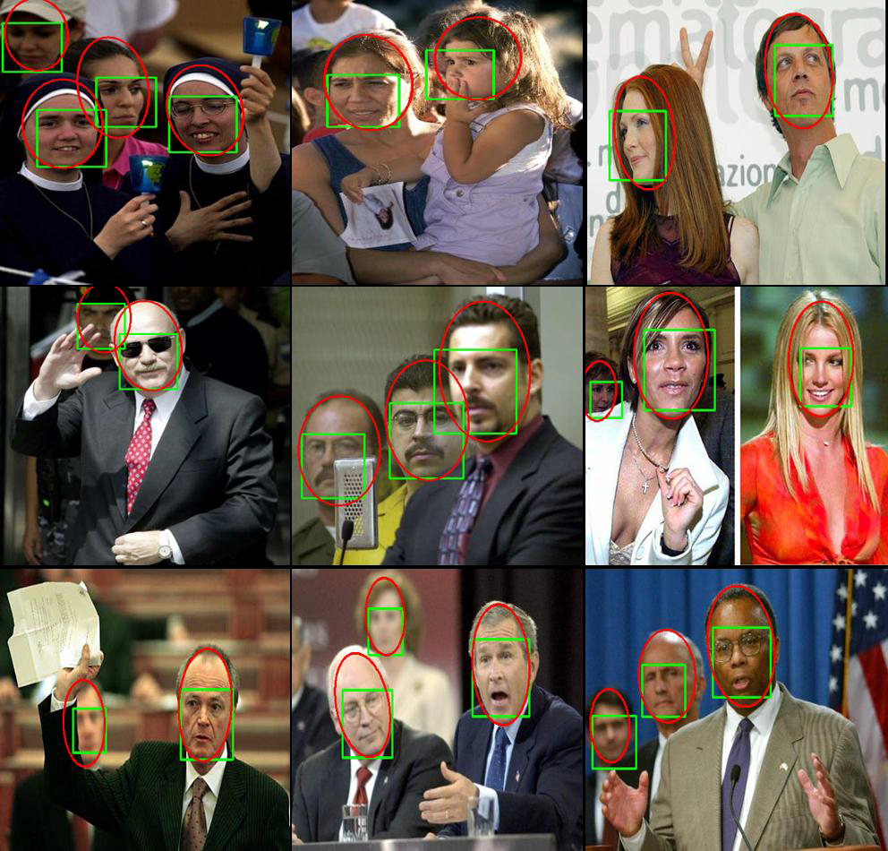
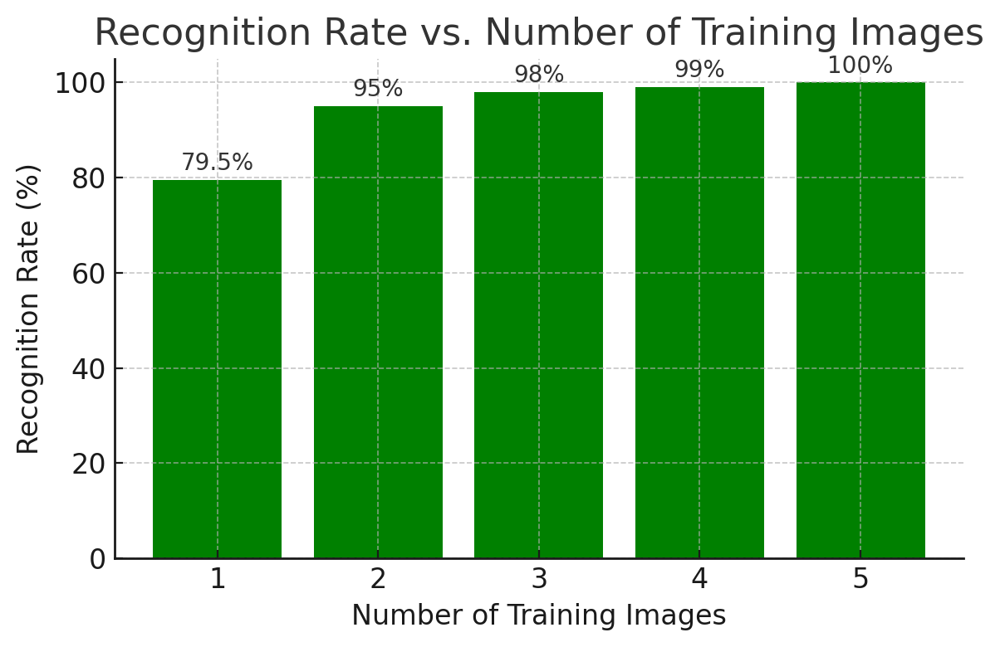

# UVface++

## Description
UVface++ is a real-time face recognition software that operates efficiently without requiring complex hardware, such as GPUs. It performs robustly under challenging conditions, including variations in lighting, pose, and expression. The source code is entirely written in C++ and leverages OpenMP for parallelization.

<div align="center">
    
</div>

## Installation and Execution (Linux)

To run the algorithm, first clone the repository:

```bash
git clone https://github.com/roggerfq/UVface.git
```

Navigate to the `UVface` folder and build the Docker image with the following command:

```bash
docker build -t uvface .
```

Finally, in the next command replace HOST_PATH with a path you want to share with the container and execute to launch UVface++:

```bash
sudo docker run --privileged -e DISPLAY \
    --env="QT_X11_NO_MITSHM=1" \
    -v /tmp/.X11-unix:/tmp/.X11-unix \
    -v HOST_PATH:/home/host \
    --device=/dev/video0:/dev/video0 \
    -it uvface
```

## Installation and Execution (Windows)

If the container is executed inside a Linux system running on WSL2, it will not have access to USB cameras. In this case, it is necessary to run the Python script [`stream.py`](/stream/stream.py) on windows to capture video from the camera and send it to `http://172.20.16.1:5000/video_feed`:

```cmd
python stream.py
```

Finally, in the next command replace HOST_PATH with a path you want to share with the container and execute to launch UVface++:

```bash
sudo docker run --privileged -e DISPLAY \
    --env="QT_X11_NO_MITSHM=1" \
    -e DEVICE_URL="http://172.20.16.1:5000/video_feed" \
    -v /tmp/.X11-unix:/tmp/.X11-unix \
    -v HOST_PATH:/home/host \
    --device=/dev/video0:/dev/video0 \
    -it uvface
```

**⚠️ Note:** To read the video from the URL, the 'device' field in the GUI must be set to `-1`.

### Face Detection

The face detection process is a cascade of classifiers (see [XML file](cascading_classifiers/clasificador_9_12102_unconstrained_f_max_0_2_evaluation.xml)) constructed using [UVtrainer](https://github.com/roggerfq/UVtrainer). The cascade is evaluated at multiple scales across the image. Each stage of the cascade consists of an ensemble of regression tree classifiers that use NPD features for evaluation [1]. The following diagram provides an overview of the face detection process:

<div align="center">
    
</div>

The video below demonstrates how to load and configure the cascade classifier for face detection:

<p align="center">
  <a href="https://youtu.be/gVwUlc-fu-I">
    
  </a>
</p>

### Face Recognition

The face recognition process in UVface++ implements the algorithm published in [2], which comprises two stages: feature extraction and classification.

1. **Feature Extraction:**
   - This stage employs the Affine Covariant Region Detector [3] to identify key points on the face image. These key points are invariant to various geometric and photometric transformations.
   - Around each key point, a Gabor feature vector of 1296 dimensions is computed. Dimensionality reduction is then performed using PCA, resulting in a 128-dimensional feature vector.

2. **Classification:**
   - The extracted features from the test image are compared against those in the dataset using Sparse Representation Classification (SRC) [4].

The following diagram provides an overview of the face recognition process:

<div align="center">
    
</div>

The video below demonstrates how to build a simple dataset and use the software for face recognition:

<p align="center">
  <a href="https://youtu.be/xdTAEethqy0">
    
  </a>
</p>

## Interface Guide

The next figure shows the main interface along with the most important panels: the face detector configuration and the face recognizer configuration GUIs.

<div align="center">
    
</div>

### Face detector configuration

This interface allows loading a cascade classifier stored in an XML file (this XML file is constructed using [UVtrainer](https://github.com/roggerfq/UVtrainer)). The interface also allows configuring the **Base size** of the search windows, the **Step Factor** with which the search windows move, and the **Scale factor** by which the search window will increase its size after finishing scanning the image. **Maximum size** refers to the maximum allowed dimension (width or height) for an input image. To understand **GroupThreshold** and **EPS**, please refer to the [OpenCV documentation](https://docs.opencv.org/4.x/de/de1/group__objdetect__common.html).

An important configuration is the **Detection degrees**; by default, it is set to 0, but it is possible to detect faces at different angles by entering each angle separated by a space, for example: `30 15 0 -15 -30`. Additionally, it is possible to enable **Normalize the rotations**, which means that the detections will adjust the best angle for the faces detected. The next video demonstrates this feature of the software:

<p align="center">
  <a href="https://youtu.be/q9VAUXHlR70">
    
  </a>
</p>

The interface also allows setting the checkbox for **Activate skin color**, which activates a simple skin color algorithm and may help improve computation speed and reduce the false positive rate.

### Face recognizer configuration

This panel allows loading or creating a database. In both cases, the first step is clicking the **Load dataset** button. If an empty folder or a folder with subfolders containing images is selected, the software will configure this folder as a database. If a folder that has been previously configured as a database is selected, the software will load the data. After that, the panel allows adding or deleting people, and adding images to each user either from files or by capturing images from a camera (see Setting the camera). The panel also allows cropping images using the mouse in the video panel and resizing individual images, all images of a user, or all images in the dataset.

This panel includes three additional tabs:

#### Description Tab

<div align="center">
    
</div>

The **Descriptor** tab allows selecting the descriptor to use. If **GTP (Gabor Ternary Pattern)** is selected, it is possible to compute the PCA matrix with features extracted from the current dataset or use a default PCA matrix computed with 1,000 individuals randomly selected from the [LFW dataset](https://vis-www.cs.umass.edu/lfw/).

#### SRC Tab

<div align="center">
    
</div>

The **SRC** tab allows configuring the parameters of the sparse solution. Key parameters include:

- **Fast filtering**: The maximum number of descriptors extracted from a test image to compute the sparse solution. The descriptors selected are those with the highest correlation with the descriptors in the database.
- **Recognition threshold**: This is compared with the confidence score given by the system to a test image. If the confidence score is higher than the threshold, the system will recognize the test image as one of the individuals in the dataset;  otherwise, it will identify the test image as "Unknown".

For more details about the other parameters in this tab, consult reference [4].

#### Test Tab

<div align="center">
    
</div>

The **Test** tab allows configuring the size to which the images will be rescaled before being processed by the face recognition system. A larger size improves accuracy but reduces computational performance.

This tab also provides the option to test only the face recognition system with images acquired from files or captured from a camera. When an image is tested, the **Result per Image** panel will display various metrics associated with the face recognition algorithm.

Finally the **Plot Sparse Solution** button opens an interactive GUI that allows:
- Viewing the sparse approximation of the descriptors for the tested image.
- Analyzing the components of the sparse solution associated with each individual in the database.
- Observing the reconstruction error for each class in the database.

The following video briefly showcases this GUI:

<p align="center">
  <a href="https://youtu.be/m9HjeDe2bR4">
    
  </a>
</p>

## Extending the System

It is possible to reimplement the feature extraction process in the face recognition algorithm. To do this, there is a special class called `ABSTRACT_DESCRIPTOR` (see [descriptor.h](https://github.com/roggerfq/UVface/blob/main/descriptor.h)) that contains three special virtual functions:

```cpp
// Virtual functions to override
cv::Mat* baseDescriptor(const cv::Mat &img) override;
void postProcessing(cv::Mat &baseDescriptor, cv::Mat &finalDescriptor, std::vector<int> &ithRows) override;
Eigen::MatrixXf* test(const cv::Mat &img) override;
```

The reimplementation of the `baseDescriptor` method should take an image as input and return the set of descriptors extracted from this image. The `postProcessing` method is called by UVface once all the descriptors for a database have been extracted. The reimplementation of `postProcessing` should take all the descriptors (`baseDescriptor`) as input, processes them, and returns the result in `baseDescriptor`. The processing algorithm implemented here could be a dimensionality reduction, such as in the case of the GTP descriptor, which uses PCA, or other algorithms. However, the algorithm used to process the descriptors should only affect their dimensions, not their quantity.

Finally, the reimplementation of the `test` method should take an image as input, extract the descriptors using `baseDescriptor`, apply the post-processing algorithm, and then return the resulting descriptors. The following C++ code snippet shows how to create the .h and .cpp files for a new descriptor. After coding, it is necessary to add the .cpp file to the CMakeLists.txt.


```cpp
#ifndef MY_NEW_DESCRIPTOR_H
#define MY_NEW_DESCRIPTOR_H

#include "descriptor.h" // Abstract base class
#include <opencv2/opencv.hpp> // Include OpenCV

class MyNewDescriptor : public ABSTRACT_DESCRIPTOR
{
    // Add private members here
public:
    MyNewDescriptor(); // Constructor
    ~MyNewDescriptor(); // Destructor

    // Virtual functions to override
    cv::Mat* baseDescriptor(const cv::Mat &img) override;
    void postProcessing(cv::Mat &baseDescriptor, cv::Mat &finalDescriptor, std::vector<int> &ithRows) override;
    Eigen::MatrixXf* test(const cv::Mat &img) override;
};

#endif
```

```cpp
#include "MyNewDescriptor.h"

MyNewDescriptor::MyNewDescriptor() {
    // Constructor implementation
}

MyNewDescriptor::~MyNewDescriptor() {
    // Destructor implementation
}

cv::Mat* MyNewDescriptor::baseDescriptor(const cv::Mat &img) {
    // Implement descriptor extraction
}

void MyNewDescriptor::postProcessing(cv::Mat &baseDescriptor, cv::Mat &finalDescriptor, std::vector<int> &ithRows) {
    // Implement post-processing
}

Eigen::MatrixXf* MyNewDescriptor::test(const cv::Mat &img) {
    cv::Mat *aux = baseDescriptor(img); // Extract base descriptors
    // Implement testing logic
    return aux; // Ensure proper memory management
}
```

Finally, include the new descriptor to the system in the line 74 of [recognizerFacial.cpp](recognizerFacial.cpp#L74
):

```cpp
#include "MyNewDescriptor.h"

RECOGNIZER_FACIAL::RECOGNIZER_FACIAL() {
    MyNewDescriptor *newDescriptor = new MyNewDescriptor;
    descriptors.push_back(newDescriptor);
}
```

## Results
### Face Detector Stage
For this test, I used the FDDB dataset [5]. The next figure shows the ROC curve:

<div align="center">
    
</div>

The following images display some results. Here, the green box represents the detection, and the red ellipse indicates the label:

<div align="center">
    
</div>

### Face Recognition Stage (Open-set Test)

The next test was carried out using images from the ALLFACES [6], YALEB [7], ORL [8], and FIE [9] datasets. Overall, the challenges in this test include pose changes, changes in expressions, and extreme lighting variations. The following table illustrates the distribution of the training set and test set, divided into genuine and impostor individuals:

| Dataset | Set Training | Genuine | Impostor |
|---------|--------------|---------|----------|
| ALLFACES | 10           | 10      | 10       |
| YALEB    | 19           | 19      | 19       |
| ORL      | 20           | 20      | 20       |
| FIE      | 100          | 100     | 100      |
| Total    | 149          | 149     | 149      |

The next figure shows the ROC curve of the test:

<div align="center">
    
</div>

### Changing the Number of Training Images (Close-set Test)
The next test was performed using the ORL dataset, choosing 5 images for testing and varying the number of training images from 5 to 1. The following graph shows the results:

<div align="center">
    
</div>

## Author
Roger Figueroa Quintero - [LinkedIn Profile](https://www.linkedin.com/in/roger-figueroa-quintero/)

## License
This project is licensed under the [MIT License](LICENSE.md), allowing unrestricted use, modification, and distribution under the terms of the license.

## References

[1] S. Liao, A. K. Jain, and S. Z. Li, "A fast and accurate unconstrained face detector," *IEEE Trans. Pattern Anal. Mach. Intell.*, vol. 38, no. 2, pp. 211-223, 2015.

[2] S. Liao, A. K. Jain, and S. Z. Li, "Partial face recognition: Alignment-free approach," IEEE Trans. Pattern Anal. Mach. Intell., vol. 35, no. 5, pp. 1193–1205, 2012.

[3] K. Mikolajczyk and C. Schmid, "Scale and affine invariant interest point detectors," *Int. J. Comput. Vision*, vol. 60, no. 1, pp. 63-86, 2004. [Online]. Available: https://www.robots.ox.ac.uk/~vgg/research/affine/detectors.html.

[4] Y. Li, "Coordinate descent optimization for l1 minimization with application to compressed sensing; a greedy algorithm solving the unconstrained problem," *Inverse Problems and Imaging*, vol. 3, pp. 1-17, 2009.

[5] Jain, V., & Learned-Miller, E. (2010). FDDB: A benchmark for face detection in unconstrained settings. University of Massachusetts Amherst. Retrieved from https://people.cs.umass.edu/~elm/papers/fddb.pdf

[6] "Collection of Facial Images," DataHub, [Online]. Available: https://old.datahub.io/dataset/collection-of-facial-images/resource/3e873716-d995-471b-9a48-0d93411ab99b. [Accessed: 18-Jan-2025].

[7] A. Georghiades, P. Belhumeur, and D. Kriegman, "From Few to Many: Illumination Cone Models for Face Recognition Under Variable Lighting and Pose," IEEE Transactions on Pattern Analysis and Machine Intelligence, vol. 23, no. 6, pp. 643-660, Jun. 2001.

[8] F. S. Samaria and A. C. Harter, "Parameterisation of a stochastic model for human face identification," Proc. 1994 IEEE Workshop on Applications of Computer Vision, Dec. 1994, pp. 138-142.

[9] C. E. Thomaz, "FEI Face Database," Center for Computing (CET), FEI University, 2004. [Online]. Available: https://fei.edu.br/~cet/facedatabase.html. [Accessed: 18-Jan-2025].

